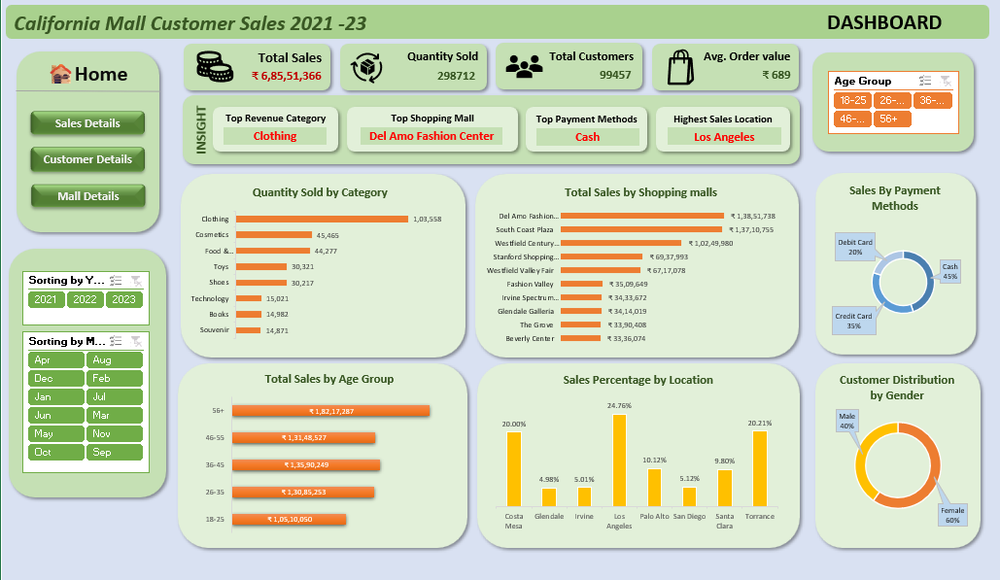
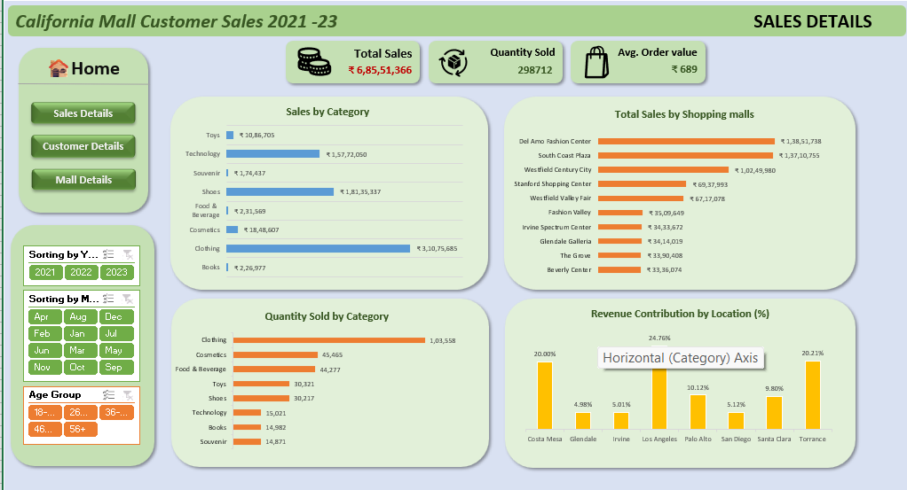
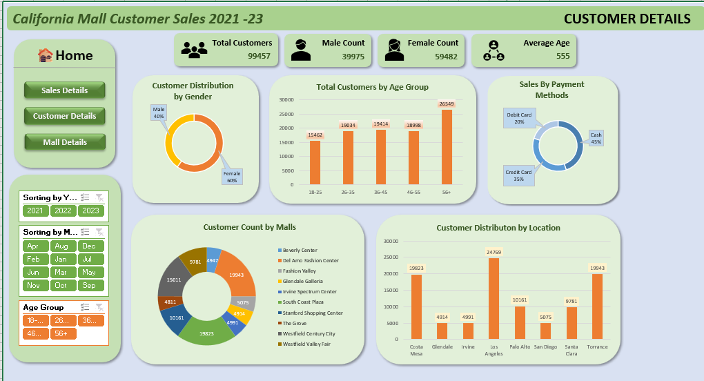
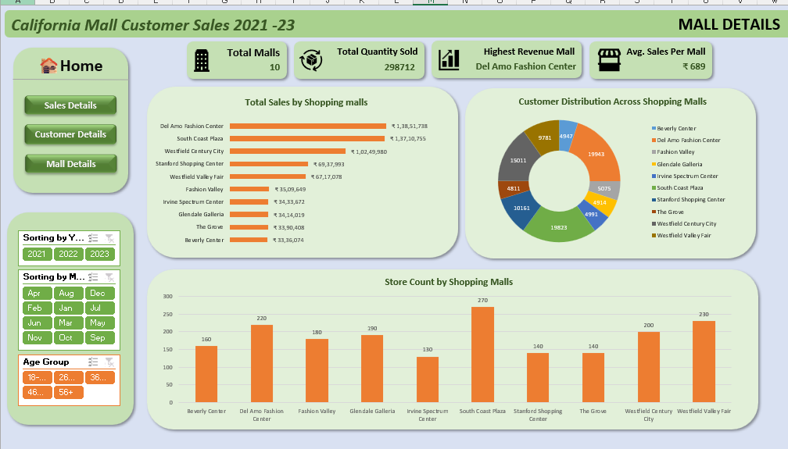

# 📊 California Shopping Mall Retail Sales Analytics Dashboard

An interactive **Business Intelligence Dashboard** built using **Microsoft Excel, Power Pivot, Excel Data Model, DAX, Pivot Tables, and Pivot Charts** to analyze retail sales performance across California shopping malls (2021–2023).

---

## 📌 Project Overview

Retail organizations generate large volumes of sales and customer data, but extracting actionable insights from multiple datasets can be challenging.

This project integrates customer, sales, and shopping mall datasets into a single interactive dashboard that enables business users to monitor KPIs, analyze customer behavior, evaluate shopping mall performance, and support data-driven decision-making.

---

## 🎯 Business Problem

Retail sales data was distributed across multiple datasets, making it difficult for management to:

- Monitor business performance
- Compare shopping mall revenue
- Analyze customer demographics
- Identify high-performing product categories
- Support strategic business decisions

This dashboard centralizes business information into an interactive reporting solution.

---

## 📂 Dataset

**Source:** Kaggle – California Mall Customer Sales Dataset

### Data Included

- 👥 Customer Dataset
- 🛒 Sales Transactions
- 🏬 Shopping Mall Information

### Dataset Summary

- **99,457** Sales Transactions
- **99,457** Customer Records
- **10** Shopping Malls
- **Analysis Period:** 2021–2023

---

## 🛠 Tools & Technologies

- Microsoft Excel
- Power Pivot
- Excel Data Model
- DAX Measures
- Pivot Tables
- Pivot Charts
- Data Visualization

---

## 📈 Dashboard Features

The solution contains four interactive dashboards:

### Executive Dashboard
- Total Sales
- Total Customers
- Average Order Value
- Revenue by Category
- Revenue by Shopping Mall
- Revenue by Location

### Sales Dashboard
- Sales by Category
- Quantity Sold
- Shopping Mall Performance
- Location-wise Revenue

### Customer Dashboard
- Customer Demographics
- Gender Distribution
- Age Group Analysis
- Payment Method Analysis

### Shopping Mall Dashboard
- Mall Performance
- Customer Distribution
- Store Count Analysis
- Revenue Contribution by City

---

## 📊 Key Performance Indicators (KPIs)

- Total Sales
- Total Customers
- Total Quantity Sold
- Average Order Value (AOV)
- Revenue Contribution
- Best Performing Shopping Mall
- Top Product Category
- Preferred Payment Method

---

## 🔍 Key Insights

- 👕 Clothing generated the highest revenue.
- 🏬 Del Amo Fashion Center was the top-performing shopping mall.
- 📍 Los Angeles contributed the highest share of total revenue.
- 👥 Customers aged **56+** represented the largest and highest-value customer segment.
- 💵 Cash remained the most preferred payment method.

---

## 💼 Business Impact

The dashboard enables stakeholders to:

- Monitor business performance through interactive KPIs
- Identify high-performing products and locations
- Understand customer purchasing behavior
- Optimize inventory planning
- Support marketing and expansion strategies
- Replace manual spreadsheet analysis with interactive business reporting

---

## 🎛 Interactive Features

- Dynamic Slicers
  - Year
  - Month
  - Age Group

- Navigation Buttons

- Interactive Pivot Charts

- Dynamic KPI Cards

---

## 📸 Dashboard Preview

> ## Executive Dashboard


> ## Sales Dashboard


> ## Customer Dashboard


> ## Mall Dashboard



---

## 📁 Repository Structure

```
Retail-Sales-Analytics-Dashboard/
│
├── Retail Sales Dashboard.xlsx
├── Project Report.pdf
├── README.md
├── Images/
│   ├── Executive Dashboard.png
│   ├── Sales Dashboard.png
│   ├── Customer Dashboard.png
│   └── Mall Dashboard.png
└── Datasets/
```

---

## 🚀 Future Improvements

- Convert the dashboard into Power BI
- Automate data refresh using Power Query
- Integrate real-time sales data
- Add forecasting and trend analysis
- Publish an interactive online dashboard

---

## 👨‍💻 Author

**Somenath Sau**

- 💼 Data Analyst
- 🐙 GitHub: https://github.com/somenathsau
- 🌐 Portfolio: https://somenathsau.github.io

---

## ⭐ If you found this project useful, consider giving it a star!
